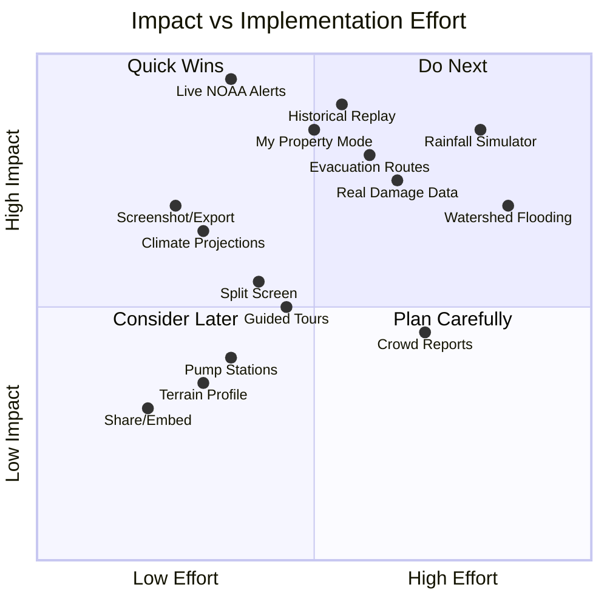

# HydroViz 3D — Feature Recommendations for Impact & Daily Use

> Analysis of what's currently built vs. what would make users come back regularly.

---

## What You Already Have (Solid Foundation)

| Feature | Status |
|:--|:--|
| CesiumJS + Google 3D Tiles | ✅ Working |
| Click-to-place water origin | ✅ Working |
| USGS bare-earth elevation + geoid calibration | ✅ Working |
| Water level slider + animated rise | ✅ Working |
| Walk mode (WASD first-person) | ✅ Working |
| Floating debris (cars) | ✅ Working |
| Damage estimation panel (mock data) | ✅ Working |
| Critical infrastructure flags (Google Places) | ✅ Working |
| 11 New Orleans preset locations | ✅ Working |
| DEM-aware flood fill + SWE solver | ✅ Code exists |

---

## Recommended Features (Ranked by Impact × Feasibility)

### 🔴 Tier 1 — "Make People Come Back" (High Impact, Builds on What You Have)

---

#### 1. **Real-Time NOAA/NWS Flood Alerts Overlay**
> *"Is my neighborhood flooding RIGHT NOW?"*

This is the #1 reason someone would open HydroViz daily.

- Pull live data from [NOAA NWS API](https://api.weather.gov/) — active flood warnings, watches, advisories
- Pull current river stage from [USGS NWIS](https://waterservices.usgs.gov/rest/IV-Service.html) — real-time gauge readings
- Show alerts as colored zones on the 3D map (red = warning, orange = watch, yellow = advisory)
- Auto-set the water level slider to match the current observed river stage
- Push notification potential: "⚠️ Mississippi River at Carrollton gauge is at 15.2ft — Minor flood stage"

```
Data flow:
  NOAA API → active alerts for lat/lng bbox
  USGS NWIS → current gauge reading (site 07374000 = Mississippi at Baton Rouge, etc.)
  → Auto-populate water level slider to match real observed conditions
  → User sees "this is what it looks like RIGHT NOW"
```

**Why it drives return visits:** People check weather apps daily. If HydroViz shows them *their* neighborhood's flood risk in 3D with live data, it becomes a weather-check habit.

---

#### 2. **Historical Flood Event Replay**
> *"Show me what Hurricane Katrina looked like from my street"*

This is what makes the tool go viral and gets shared.

- Pre-built scenarios for landmark events:
  - **Hurricane Katrina (2005)** — levee breaches, 15+ ft flooding in Lower 9th Ward
  - **Hurricane Ida (2021)** — storm surge + rainfall flooding
  - **May 2017 Flash Flood** — 6+ inches of rain in 3 hours
  - **Hurricane Isaac (2012)**
- Time slider: scrub through the flood timeline (hour by hour)
- Side-by-side or overlay of actual FEMA high-water marks vs. simulated depth
- "Play" button to watch the flood unfold over the 3D terrain

**Data sources:** USGS flood event peak data, FEMA high-water marks database, NOAA storm surge hindcasts

**Why it drives return visits:** Educational tool for schools, training tool for emergency managers, compelling for anyone who lived through these events.

---

#### 3. **"My Property" Mode — Personalized Flood Risk Dashboard**
> *"What's MY flood risk? How much would MY house be damaged at 3ft, 5ft, 10ft?"*

- User enters their address (or clicks their house)
- App shows:
  - FEMA flood zone designation (AE, X, VE, etc.)
  - Base Flood Elevation (BFE) vs. their ground elevation
  - Depth-damage curve: a chart showing $ loss at each water depth (1ft, 2ft, 3ft... 10ft)
  - Flood insurance estimate (based on zone + elevation)
  - Nearest evacuation routes and shelters
- Save/bookmark their property for quick access
- "Compare scenarios" — see their house under 100-yr, 500-yr, hurricane surge scenarios side by side

**Why it drives return visits:** Deeply personal. Homeowners, renters, and real estate buyers would check before/during storm season.

---

#### 4. **Evacuation Route Visualization**
> *"If water is at 5ft, can I still drive out?"*

- Show major road network overlaid on the 3D terrain
- Color roads by passability at current water level:
  - 🟢 **Green** = road above water (safe)
  - 🟡 **Yellow** = road within 6 inches of water (risky)
  - 🔴 **Red** = road submerged (impassable)
- Route planning: "Get me to the nearest shelter that's still accessible"
- Mark known low-lying underpasses/intersections that flood first (e.g., Claiborne Ave underpasses)

**Data sources:** OpenStreetMap road network + your DEM data to check road elevation at each segment.

**Why it drives return visits:** Emergency preparedness — exactly the kind of tool people pull up during a hurricane warning.

---

### 🟡 Tier 2 — "Professional & Educational Value" (Medium Effort, High Payoff)

---

#### 5. **Comparison / Split-Screen Mode**
> *"Show me dry vs. 10ft flooding side by side"*

- Split the viewport into two synchronized cameras
- Left: current/dry conditions — Right: flooded scenario
- Both cameras move together (orbit, zoom, fly)
- Or: Before/After slider overlay (drag a divider left/right)
- Great for presentations, reports, and public communication

---

#### 6. **Screenshot & Report Export**
> *"Generate a PDF I can give to my city council / insurance company"*

- One-click screenshot of current 3D view (high-res PNG)
- Auto-generated PDF report containing:
  - Location, coordinates, ground elevation
  - Flood scenario name + water depth
  - Estimated damage ($)
  - 3D screenshot
  - FEMA flood zone info
  - Nearby critical infrastructure affected
- Shareable link: encode the current scenario (location + water level + camera angle) as a URL parameter so others can see the exact same view

---

#### 7. **Multi-Point / Watershed Flooding**
> *"Don't just flood from one point — show me the whole watershed"*

Currently the app floods from a single click origin. To be realistic:
- Allow multiple water sources (river, canal, storm surge from lake)
- Use watershed boundaries to contain flooding naturally
- Show levee lines and let users "breach" a levee at a point to see cascading inundation
- This is where the existing SWE solver becomes critical

---

#### 8. **Climate Change Sea Level Rise Projections**
> *"What does New Orleans look like in 2050? 2100?"*

- Toggle between IPCC scenarios (SSP1-2.6, SSP2-4.5, SSP5-8.5)
- Show permanent inundation at projected sea levels (+1ft, +3ft, +6ft)
- Overlay with land subsidence data (NOLA sinks ~1 inch/decade in some areas)
- Show which neighborhoods become permanently below sea level
- Timeline scrubber: 2025 → 2050 → 2075 → 2100

**Data:** [Climate Central](https://ss2.climatecentral.org/) datasets, NOAA sea level rise projections

---

#### 9. **Building-Level Damage Inventory (Real Data)**
> Replace the mock damage data with real HAZUS-MH depth-damage functions

Currently [DamagePanel.js](file:///Users/samratshrestha/Developer/3dworldcesium/src/ui/DamagePanel.js) uses mock formulas. To make it professional:
- Integrate **FEMA HAZUS** depth-damage functions (real curves for RES1, COM1, IND1, etc.)
- Pull actual building footprints from **Microsoft Building Footprints** or **OpenStreetMap**
- Show aggregate statistics: "At this water level, X buildings are flooded, estimated total loss: $Y million"
- Heat map overlay: color buildings by damage severity

---

#### 10. **Rainfall Simulator**
> *"What happens if we get 6 inches of rain in 2 hours?"*

- Input: rainfall intensity (inches/hour) and duration
- The SWE solver (which you already have in [SWESolver.js](file:///Users/samratshrestha/Developer/3dworldcesium/src/water/SWESolver.js)) computes runoff and ponding
- Watch water accumulate in low spots, flow through streets, overwhelm drainage
- Compare with pump station capacity (New Orleans has 120+ drainage pumps — some failed during Katrina)
- This is uniquely compelling for New Orleans where rainfall flooding is the #1 annual hazard

---

### 🟢 Tier 3 — "Polish & Engagement" (Quick Wins)

---

#### 11. **Guided Tours / Stories Mode**
- Pre-built narrated fly-through tours:
  - "Hurricane Katrina: A 3D Tour of the Lower 9th Ward"
  - "New Orleans Flood Defenses: Levees, Floodwalls, and Pump Stations"
  - "Your Neighborhood's Flood Risk in 60 Seconds"
- Auto-play camera movements with text overlays and water level changes
- Export as video recording for presentations

---

#### 12. **Crowd-Sourced Flood Reports**
> *"I see water on my street — report it"*

- Users can drop pins with photo uploads during active flood events
- Other users see real-time crowd-sourced flood reports on the 3D map
- Validates the simulation and provides ground truth
- Requires a simple backend (Firebase or Supabase for real-time DB)

---

#### 13. **Pump Station Status Dashboard**
> Specific to New Orleans but incredibly practical

- Show all 120+ Sewerage & Water Board pump stations as 3D markers
- Status: operational / degraded / offline (pull from S&WB status page or mock)
- When pumps are "offline," the rainfall simulator shows worse flooding
- Users can toggle pumps on/off to see the difference

---

#### 14. **Terrain Profile / Cross-Section Tool**
- User draws a line on the map
- App shows a 2D elevation profile along that line
- Overlay the current water level on the profile
- Shows where water would be above/below ground along any transect
- Invaluable for understanding why certain streets flood and others don't

---

#### 15. **Embed / Share Widget**
- Embeddable iframe for news websites, city dashboards
- "Share this view" button generates a URL with encoded state
- QR code generation for printed materials
- Social media share cards with auto-generated preview images

---

## Implementation Priority Matrix



## Recommended Build Order

| Phase | Features | Why This Order |
|:--|:--|:--|
| **Next Sprint** | Live NOAA alerts, Screenshot/Export, Climate SLR projections | Low effort, immediate practical value, drives daily use |
| **Sprint +1** | Historical Katrina replay, My Property mode | The "wow factor" — this is what gets people talking |
| **Sprint +2** | Evacuation routes, Real HAZUS damage data | Professional credibility — makes it a real planning tool |
| **Sprint +3** | Rainfall simulator, Split-screen, Terrain profile | Advanced analysis — researchers and planners use this daily |
| **Backlog** | Guided tours, Crowd reports, Pump stations, Embed/share | Community engagement and distribution features |

---

## The "Killer Feature" Combination

The single most impactful combination that would make HydroViz a tool people *need* rather than just *try*:

> **Live NOAA alerts** + **My Property mode** + **Evacuation routes**

This turns HydroViz from a "cool demo" into a **personal flood safety dashboard**:
1. Open the app → see if there are any active flood warnings (NOAA)
2. Check your saved property → see the real-time risk level
3. If evacuation is needed → see which routes are still passable

This is especially powerful during **hurricane season** (June–November) when millions of Gulf Coast residents are checking weather apps constantly.
