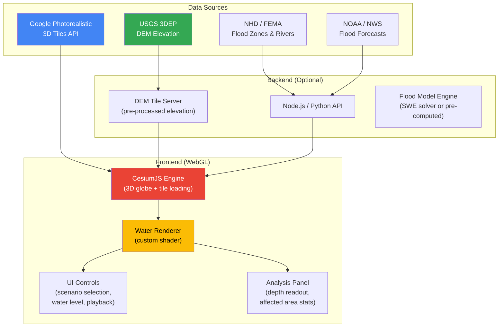
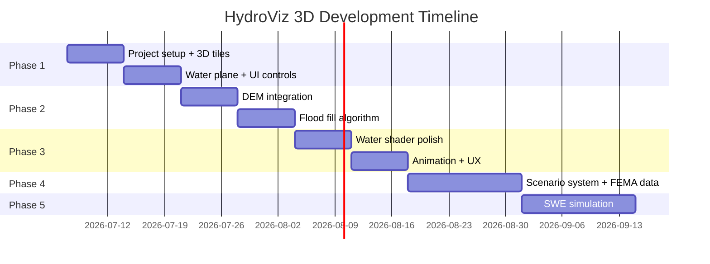

# HydroViz 3D: Interactive Flood Simulation on Photorealistic 3D Terrain

> A comprehensive project blueprint for building an interactive 3D flood simulation visualization tool using Google Photorealistic 3D Tiles, real elevation data, and WebGL-based water rendering.

---

## 1. Project Vision

### What We're Building
An interactive web application where a user can:
1. **Navigate** to any location in the US (or globally) on a photorealistic 3D map
2. **Select** a flood scenario (100-year flood, hurricane surge, dam break, custom water level)
3. **Watch** water rise and flow through the 3D environment in real-time
4. **Explore** the flooded scene from street level, aerial view, or any camera angle
5. **Analyze** flood depth, affected structures, and inundation extent

### Research Framing

> *"We present HydroViz 3D, a web-based interactive flood simulation platform that combines Google's Photorealistic 3D Tiles with physics-informed water surface modeling and real-world DEM elevation data to enable immersive, street-level flood scenario visualization for any location with 3D tile coverage."*

#### Key Research Contributions
1. **Novel visualization paradigm** — First tool to overlay dynamic flood simulation on photorealistic 3D tile environments at arbitrary locations
2. **Multi-scale interaction** — Seamless transition from watershed-scale overview to street-level immersive flood experience
3. **Real-time scenario exploration** — Interactive parameter adjustment (water level, flow rate, storm event) with immediate visual feedback
4. **Accessible flood risk communication** — Non-expert users can understand flood impact intuitively through 3D immersion

### Why Not WorldMirror / AI Reconstruction?

From our exploration of HY-World 2.0 (WorldMirror):

| Approach | Limitation for This Project |
|:--|:--|
| WorldMirror 2.0 | Requires manual photo capture per site, outputs relative (non-metric) depth, no georeferencing |
| Google 3D Tiles | Pre-built, georeferenced, global coverage, real-world coordinates — ready for simulation overlay |

WorldMirror is powerful for reconstructing specific small scenes from photos, but for a scalable flood simulation tool covering arbitrary locations, Google's pre-built 3D Tiles are the practical foundation.

> [!NOTE]
> WorldMirror could still be valuable as a **fallback** for locations without Google 3D Tile coverage, or for **custom high-resolution site surveys** using drone imagery. Consider it as a future enhancement.

---

## 2. System Architecture



### Component Overview

| Component | Technology | Purpose |
|:--|:--|:--|
| **3D Visualization** | CesiumJS | Renders Google 3D Tiles, camera controls, globe |
| **Water Rendering** | Custom GLSL shaders in Cesium | Animated, semi-transparent water surface with reflections |
| **Elevation Data** | USGS 3DEP (1m-10m DEM) | Real terrain heights for water level calculations |
| **Flood Scenarios** | Pre-computed or real-time SWE | Water depth grids at each timestep |
| **UI Framework** | Vanilla JS or React | Controls, panels, scenario selection |
| **Backend (optional)** | Node.js or Python (FastAPI) | DEM serving, flood model API, data processing |

---

## 3. Technology Stack

### Core Dependencies

```json
{
  "dependencies": {
    "cesium": "^1.120",
    "resium": "^1.18"
  }
}
```

### Why CesiumJS (Not Three.js)

| Feature | CesiumJS | Three.js |
|:--|:--|:--|
| Google 3D Tiles loading | ✅ Built-in (`Cesium3DTileset`) | ❌ Requires custom loader |
| Globe / terrain | ✅ Built-in with WGS84 | ❌ Manual, no globe |
| Georeferenced coordinates | ✅ Native lat/lng/elevation | ❌ Must implement yourself |
| Camera fly-to locations | ✅ `camera.flyTo()` | ❌ Manual |
| Terrain clamping | ✅ `clampToGround` | ❌ Manual raycasting |
| 3D Tiles spec support | ✅ Full | ⚠️ Partial via `3d-tiles-renderer` |

> [!IMPORTANT]
> CesiumJS is the clear choice here. It natively supports Google 3D Tiles, georeferenced coordinates, and terrain — all critical for placing water at correct real-world elevations.

### Alternative: deck.gl + Google Maps
Google also offers Photorealistic 3D Tiles through the **Maps JavaScript API** with deck.gl integration. This is simpler but gives less control over custom rendering (water shaders).

---

## 4. Data Sources

### 4a. Google Photorealistic 3D Tiles

**What:** Photorealistic 3D mesh tiles covering most populated areas globally.

**API Setup:**
1. Go to [Google Cloud Console](https://console.cloud.google.com/)
2. Create a new project or select existing
3. Enable the **Map Tiles API**
4. Create an API key
5. Restrict the key to Map Tiles API + your domain

**Pricing (as of 2024):**
- Free: First $200/month credit (~14,000 tile loads)
- After: $6 per 1,000 tile sessions
- Academic/research: Apply for Google for Education credits

**Loading in CesiumJS:**
```javascript
// Option A: Via Google Map Tiles API directly
const tileset = await Cesium.createGooglePhotorealistic3DTileset({
    key: 'YOUR_GOOGLE_API_KEY'
});
viewer.scene.primitives.add(tileset);

// Option B: Via Cesium Ion (simpler, Google tiles hosted on Ion)
const tileset = await Cesium.Cesium3DTileset.fromIonAssetId(2275207);
viewer.scene.primitives.add(tileset);
```

> [!TIP]
> **Start with Cesium Ion** (Option B) during development — it handles authentication and has a free tier. Switch to direct Google API for production to control costs.

---

### 4b. Elevation Data (DEM) — USGS 3DEP

**What:** High-resolution Digital Elevation Models for the entire US.

| Product | Resolution | Coverage | Use Case |
|:--|:--|:--|:--|
| 3DEP 1m DEM | 1 meter | Most urban/suburban US | High-precision flood modeling |
| 3DEP 1/3 arc-sec | ~10 meters | All of US | Watershed-scale analysis |
| 3DEP 1 arc-sec | ~30 meters | All of US | Overview / large areas |

**Access Methods:**
```
# REST API (The National Map)
https://elevation.nationalmap.gov/arcgis/rest/services/3DEPElevation/ImageServer

# Direct download (GeoTIFF tiles)
https://apps.nationalmap.gov/downloader/

# Python (elevation at a point)
import requests
url = "https://epqs.nationalmap.gov/v1/json"
params = {"x": -86.52, "y": 39.16, "units": "Meters", "wkid": 4326}
response = requests.get(url, params=params)
elevation = response.json()["value"]  # e.g., 218.5 meters
```

**For the app, you'll want to:**
1. Pre-download DEM tiles for your target areas
2. Serve them as terrain tiles or a lookup API
3. Use them to determine where water goes (flow direction, accumulation)

---

### 4c. Flood Data Sources

| Source | Data | URL |
|:--|:--|:--|
| **FEMA NFHL** | Official flood zones (100-year, 500-year) | [msc.fema.gov](https://msc.fema.gov/portal/home) |
| **NOAA NWS** | Real-time river flood forecasts | [water.weather.gov](https://water.weather.gov/) |
| **USGS NWIS** | Stream gauge data (current water levels) | [waterdata.usgs.gov](https://waterdata.usgs.gov/) |
| **NHD** | River/stream network geometry | [nhd.usgs.gov](https://www.usgs.gov/national-hydrography/national-hydrography-dataset) |
| **Your MIDAS app** | Your existing flood map data | Already have this! |

---

## 5. Flood Simulation Approaches

### Approach 1: Static Water Plane (Simplest — Start Here)

Raise a flat water surface to a user-specified elevation. Areas of terrain below that elevation are "flooded."

```
User sets water level = 220m
    ↓
For each point on terrain:
    if DEM_elevation < 220m → underwater (render water)
    if DEM_elevation ≥ 220m → above water (no water)
```

**Pros:** Dead simple, instant, good for "what if water reaches X meters"
**Cons:** Not physically realistic (water doesn't pool in disconnected low spots)

```javascript
// Pseudo-code for water plane in CesiumJS
const waterLevel = 220.0; // meters above sea level
const waterEntity = viewer.entities.add({
    polygon: {
        hierarchy: Cesium.Cartesian3.fromDegreesArray(floodBoundary),
        height: waterLevel,
        material: new Cesium.Color(0.1, 0.3, 0.8, 0.6), // semi-transparent blue
        extrudedHeight: waterLevel - maxDepth, // fill down to ground
    }
});
```

---

### Approach 2: DEM-Aware Flood Fill (Medium Complexity — Phase 2)

Use the DEM to compute connected inundation zones:

```
Given: water level H, seed point (river location)
    ↓
BFS/flood-fill on DEM grid:
    Start at seed cell
    Expand to neighbors if neighbor_elevation < H
    Mark as flooded
    ↓
Result: connected flood polygon at correct elevation
    + depth map (H - elevation at each cell)
```

**Pros:** Physically plausible — water only fills connected low areas
**Cons:** Doesn't model flow dynamics (just static final state)

This can run **in the browser** using a Web Worker on a DEM grid tile.

---

### Approach 3: Shallow Water Equations (Advanced — Phase 3)

Full 2D physics simulation of water flow over terrain:

```
∂h/∂t + ∂(hu)/∂x + ∂(hv)/∂y = R(t)     (mass conservation)
∂(hu)/∂t + ... = -gh·∂z/∂x - friction    (momentum x)
∂(hv)/∂t + ... = -gh·∂z/∂y - friction    (momentum y)

where:
  h = water depth
  u,v = velocity components
  z = terrain elevation (from DEM)
  R(t) = rainfall or inflow
  g = gravity
```

**Implementation options:**
- **GPU-accelerated in browser:** WebGPU compute shaders (bleeding edge)
- **Server-side:** Python (shallow-water solver) → stream results to browser
- **Pre-computed:** Run simulation offline → save frames → replay in browser

> [!TIP]
> **Start with Approach 1**, get the visualization working, then progressively upgrade to Approach 2 and 3. Each builds on the previous.

---

## 6. Water Rendering (Visual Quality)

### Basic Water Material
```javascript
// CesiumJS water material
const waterMaterial = new Cesium.Material({
    fabric: {
        type: 'Water',
        uniforms: {
            baseWaterColor: new Cesium.Color(0.1, 0.2, 0.4, 0.7),
            normalMap: Cesium.buildModuleUrl('Assets/Textures/waterNormals.jpg'),
            frequency: 1000.0,
            animationSpeed: 0.01,
            amplitude: 5.0,
        }
    }
});
```

### Advanced Water (Custom Shader)
For a research-grade visualization, implement:
- **Animated wave normals** — ripple effect using normal maps
- **Fresnel reflections** — reflect the 3D tiles at glancing angles
- **Depth-based color** — darker water where deeper (from DEM difference)
- **Foam/edge effects** — white foam where water meets buildings
- **Transparency gradient** — shallow water shows ground underneath
- **Debris particles** — floating objects for immersion (optional)

---

## 7. Project Structure

```
hydroviz-3d/
├── index.html
├── package.json
├── vite.config.js
├── public/
│   └── textures/
│       ├── waterNormals.jpg
│       └── foam.png
├── src/
│   ├── main.js                  # App entry point
│   ├── viewer.js                # CesiumJS viewer setup
│   ├── tiles.js                 # Google 3D Tiles loading
│   ├── water/
│   │   ├── WaterRenderer.js     # Water surface rendering
│   │   ├── WaterMaterial.glsl   # Custom water shader
│   │   └── FloodFill.js         # DEM-based flood calculation
│   ├── elevation/
│   │   ├── DEMLoader.js         # Load DEM tiles from USGS
│   │   └── ElevationService.js  # Query elevation at lat/lng
│   ├── scenarios/
│   │   ├── ScenarioManager.js   # Manage flood scenarios
│   │   ├── presets.json         # Pre-defined scenarios (100yr, 500yr, etc.)
│   │   └── SWESolver.js         # Shallow water equations (Phase 3)
│   ├── ui/
│   │   ├── Controls.js          # Water level slider, scenario picker
│   │   ├── InfoPanel.js         # Depth readout, affected area stats
│   │   └── LocationSearch.js    # Search for locations
│   └── styles/
│       └── index.css
├── server/                      # Optional backend
│   ├── dem_server.py            # Serve DEM tiles
│   └── flood_api.py             # Pre-computed flood scenarios
└── data/
    ├── dem/                     # Cached DEM tiles (GeoTIFF)
    └── flood_zones/             # FEMA flood zone polygons (GeoJSON)
```

---

## 8. Development Roadmap

### Phase 1: Foundation (Week 1-2) 🟢
**Goal: 3D tiles + basic water plane visible**

- [ ] Set up Vite project with CesiumJS
- [ ] Load Google Photorealistic 3D Tiles
- [ ] Implement location search (geocoding)
- [ ] Add a flat water plane at user-specified elevation
- [ ] Water level slider control
- [ ] Basic camera controls (fly-to, orbit, street-level view)
- [ ] Deploy to localhost, verify 3D tiles load

**Deliverable:** Navigate to any city, set water level, see blue plane intersecting buildings.

---

### Phase 2: Real Elevation (Week 3-4) 🟡
**Goal: Water respects actual terrain**

- [ ] Integrate USGS 3DEP elevation API
- [ ] Query DEM grid for the visible area
- [ ] Implement flood fill algorithm on DEM grid
- [ ] Generate flood extent polygon from flood fill
- [ ] Render water only in connected low areas
- [ ] Show flood depth color gradient (shallow=light blue, deep=dark blue)
- [ ] Add depth readout on mouse hover

**Deliverable:** Water realistically fills valleys and avoids hills.

---

### Phase 3: Visual Polish (Week 5-6) 🟡
**Goal: Publication-quality water rendering**

- [ ] Custom water shader (animated normals, reflections, transparency)
- [ ] Depth-dependent water appearance
- [ ] Foam/edge effects where water meets structures
- [ ] Time animation (water rising/falling)
- [ ] Before/after comparison slider
- [ ] Screenshot/recording capability

**Deliverable:** Visually compelling flood visualization suitable for paper figures.

---

### Phase 4: Scenarios & Analysis (Week 7-8) 🔴
**Goal: Pre-defined flood scenarios with analysis**

- [ ] Integrate FEMA flood zone data (100-year, 500-year boundaries)
- [ ] Load real flood stage data from USGS gauges
- [ ] Pre-defined scenarios: "Category 3 Hurricane", "100-Year Flood", "Dam Break"
- [ ] Compute affected area statistics (sq km flooded, buildings impacted)
- [ ] Export results (PDF report, GeoJSON flood extent)
- [ ] Connect with your MIDAS flood data if applicable

**Deliverable:** Select a scenario, watch it play out, get analysis.

---

### Phase 5: Advanced Simulation (Week 9+) 🔴
**Goal: Physics-based water flow**

- [ ] Implement SWE solver (WebGPU or server-side)
- [ ] Animate water flowing through streets/channels
- [ ] Dynamic rainfall input → runoff → flooding
- [ ] Compare with observed flood events for validation

**Deliverable:** Full physics simulation on photorealistic 3D terrain.

---

## 9. Quick Start — Getting Running in 30 Minutes

### Step 1: Create the Project
```bash
mkdir hydroviz-3d && cd hydroviz-3d
npm init -y
npm install cesium vite vite-plugin-cesium
```

### Step 2: Minimal Working Example

**`index.html`:**
```html
<!DOCTYPE html>
<html>
<head>
    <meta charset="utf-8">
    <title>HydroViz 3D</title>
    <style>
        body { margin: 0; padding: 0; overflow: hidden; }
        #cesiumContainer { width: 100%; height: 100vh; }
        #controls {
            position: absolute; top: 10px; left: 10px; z-index: 999;
            background: rgba(0,0,0,0.8); color: white; padding: 16px;
            border-radius: 8px; font-family: sans-serif;
        }
        #controls label { display: block; margin: 8px 0 4px; }
        #controls input[type=range] { width: 200px; }
    </style>
</head>
<body>
    <div id="cesiumContainer"></div>
    <div id="controls">
        <h3>🌊 Flood Simulator</h3>
        <label>Water Level: <span id="levelDisplay">0</span>m</label>
        <input type="range" id="waterLevel" min="0" max="20" step="0.5" value="0">
        <label>Location</label>
        <select id="location">
            <option value="-86.52,39.16">Indianapolis, IN</option>
            <option value="-90.07,29.95">New Orleans, LA</option>
            <option value="-95.37,29.76">Houston, TX</option>
            <option value="-73.97,40.78">New York, NY</option>
        </select>
        <button id="flyTo">Go</button>
    </div>
    <script type="module" src="./src/main.js"></script>
</body>
</html>
```

**`src/main.js`:**
```javascript
import * as Cesium from 'cesium';
import 'cesium/Build/Cesium/Widgets/widgets.css';

// Set your Cesium Ion token (free account at cesium.com)
Cesium.Ion.defaultAccessToken = 'YOUR_CESIUM_ION_TOKEN';

// Create viewer
const viewer = new Cesium.Viewer('cesiumContainer', {
    timeline: false,
    animation: false,
    baseLayerPicker: false,
    geocoder: true,
});

// Load Google Photorealistic 3D Tiles
const tileset = await Cesium.Cesium3DTileset.fromIonAssetId(2275207);
viewer.scene.primitives.add(tileset);

// Disable default terrain (3D tiles include their own)
viewer.scene.globe.show = false;

// Water entity (starts invisible at 0m)
let waterEntity = null;

function updateWater(lat, lng, waterLevelAboveGround) {
    if (waterEntity) viewer.entities.remove(waterEntity);
    if (waterLevelAboveGround <= 0) return;
    
    // Create a water polygon around the target location
    const size = 0.01; // ~1km radius
    const positions = Cesium.Cartesian3.fromDegreesArray([
        lng - size, lat - size,
        lng + size, lat - size,
        lng + size, lat + size,
        lng - size, lat + size,
    ]);
    
    // Query terrain elevation at the center point
    // (simplified — in production, use DEM grid)
    const terrainElevation = 200; // placeholder — replace with real DEM query
    
    waterEntity = viewer.entities.add({
        polygon: {
            hierarchy: positions,
            height: terrainElevation + waterLevelAboveGround,
            material: Cesium.Color.fromCssColorString('rgba(30, 100, 200, 0.6)'),
        }
    });
}

// UI Controls
const slider = document.getElementById('waterLevel');
const display = document.getElementById('levelDisplay');
const locationSelect = document.getElementById('location');

slider.addEventListener('input', () => {
    const level = parseFloat(slider.value);
    display.textContent = level;
    const [lng, lat] = locationSelect.value.split(',').map(Number);
    updateWater(lat, lng, level);
});

document.getElementById('flyTo').addEventListener('click', () => {
    const [lng, lat] = locationSelect.value.split(',').map(Number);
    viewer.camera.flyTo({
        destination: Cesium.Cartesian3.fromDegrees(lng, lat, 500),
        orientation: {
            heading: Cesium.Math.toRadians(0),
            pitch: Cesium.Math.toRadians(-45),
            roll: 0,
        }
    });
});

// Fly to default location
viewer.camera.flyTo({
    destination: Cesium.Cartesian3.fromDegrees(-86.52, 39.16, 500),
    orientation: {
        heading: 0,
        pitch: Cesium.Math.toRadians(-45),
        roll: 0,
    }
});
```

### Step 3: Run It
```bash
npx vite
# Open http://localhost:5173
```

---

## 10. API Keys & Accounts Needed

| Service | What For | Cost | Link |
|:--|:--|:--|:--|
| **Cesium Ion** | 3D Tiles hosting, terrain | Free tier (75k tiles/mo) | [cesium.com/ion](https://cesium.com/ion/) |
| **Google Cloud** | Map Tiles API (if not using Ion) | $200 free/month | [console.cloud.google.com](https://console.cloud.google.com/) |
| **USGS** | DEM elevation data | Free | [apps.nationalmap.gov](https://apps.nationalmap.gov/) |

> [!TIP]
> **Start with just a Cesium Ion account.** It provides Google 3D Tiles through asset ID 2275207, so you don't even need a Google Cloud account initially. One account, one API key, and you're running.

---

## 11. Potential Integration with Your MIDAS Project

Your existing [MIDAS](file:///c:/Users/sshrestha3/Desktop/Projects/midas) flood map application already has:
- Flood zone data and mapping (`flood_map.php`, `flood_map2.php`)
- Mitigation strategies (`mitigations.json`)
- Summary and analysis views

HydroViz 3D could be a **3D companion view** to MIDAS — when a user views a flood zone in the 2D MIDAS map, they click "View in 3D" and see the same location in immersive photorealistic 3D with water overlay.

---

## 12. References & Inspiration

| Project | What It Does | Relevance |
|:--|:--|:--|
| [FloodMap.io](https://www.floodmap.io/) | 2D flood visualization by elevation | Similar concept but in 2D |
| [Climate Central Surging Seas](https://ss2.climatecentral.org/) | Sea level rise visualization | Similar use case, good UX reference |
| [Cesium Stories](https://cesium.com/platform/cesium-stories/) | 3D narrative with Cesium | Presentation format inspiration |
| [Google Earth Engine](https://earthengine.google.com/) | Satellite analysis platform | Data source for historical floods |
| [TUFLOW](https://www.tuflow.com/) | Professional flood modeling | Gold standard for SWE simulation |

---

## 13. Summary



**Start simple. Ship Phase 1 in a week. Iterate.**
